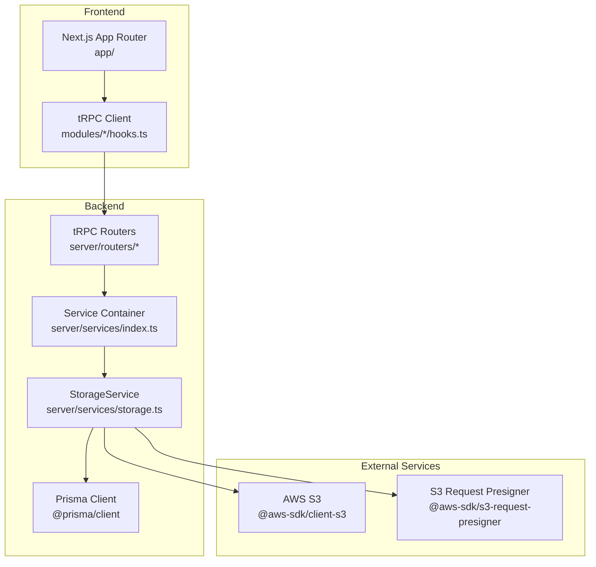
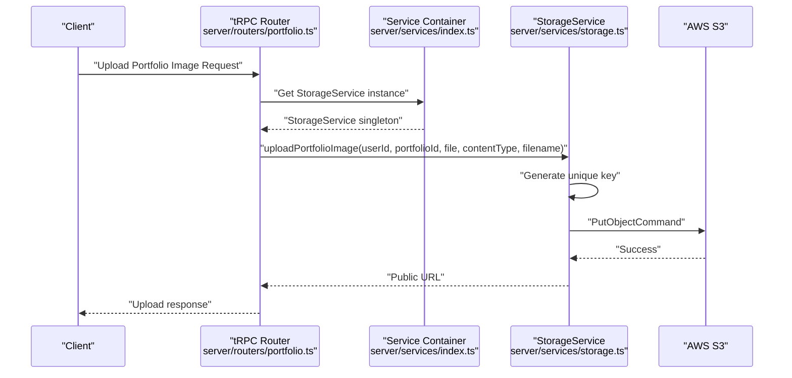
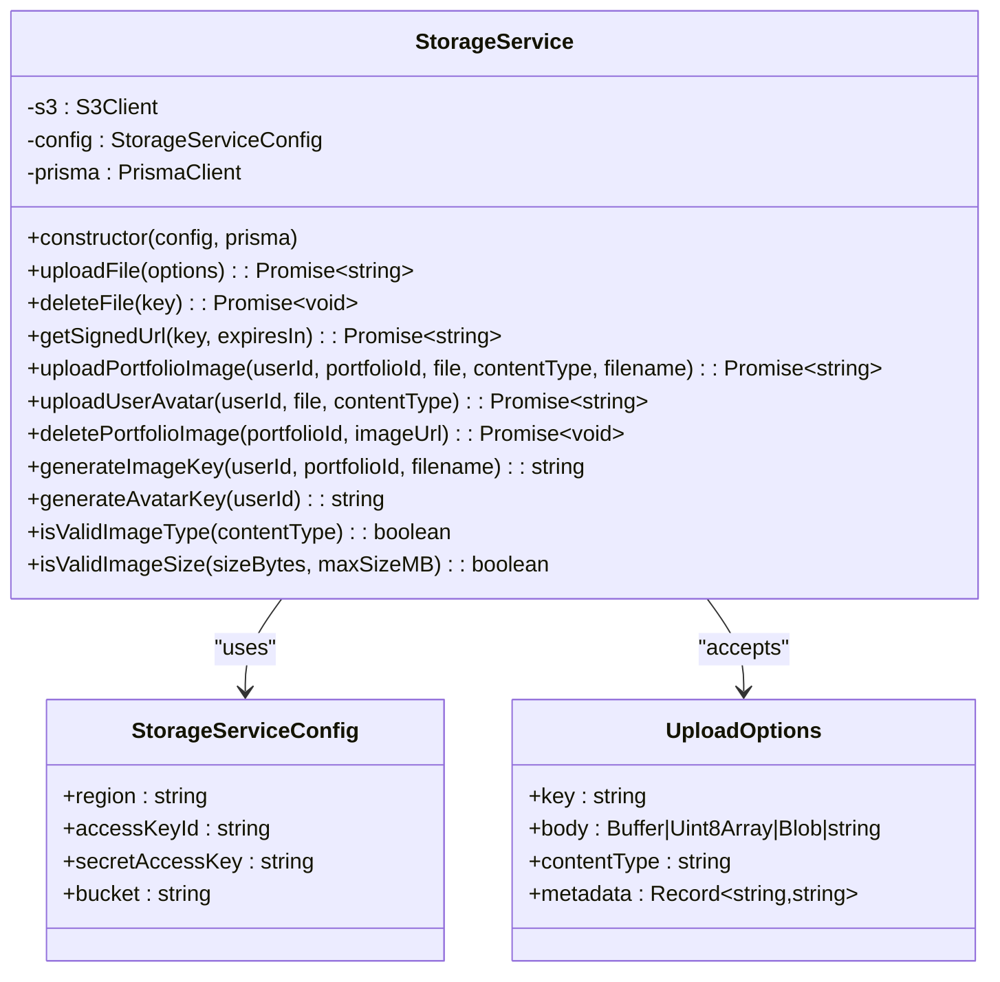
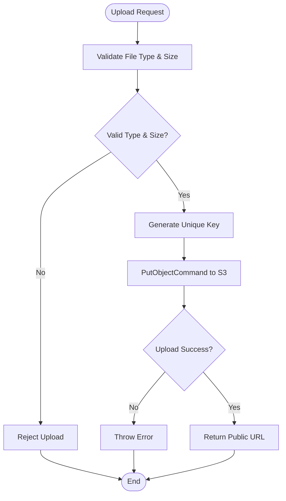
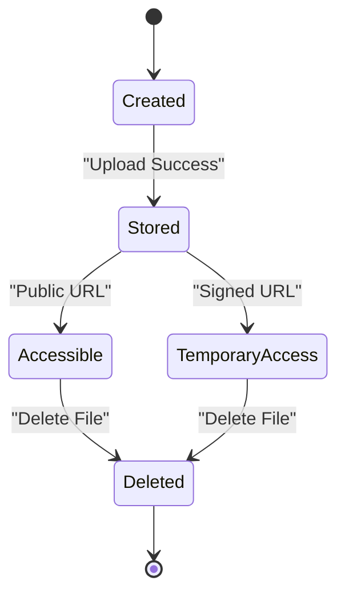
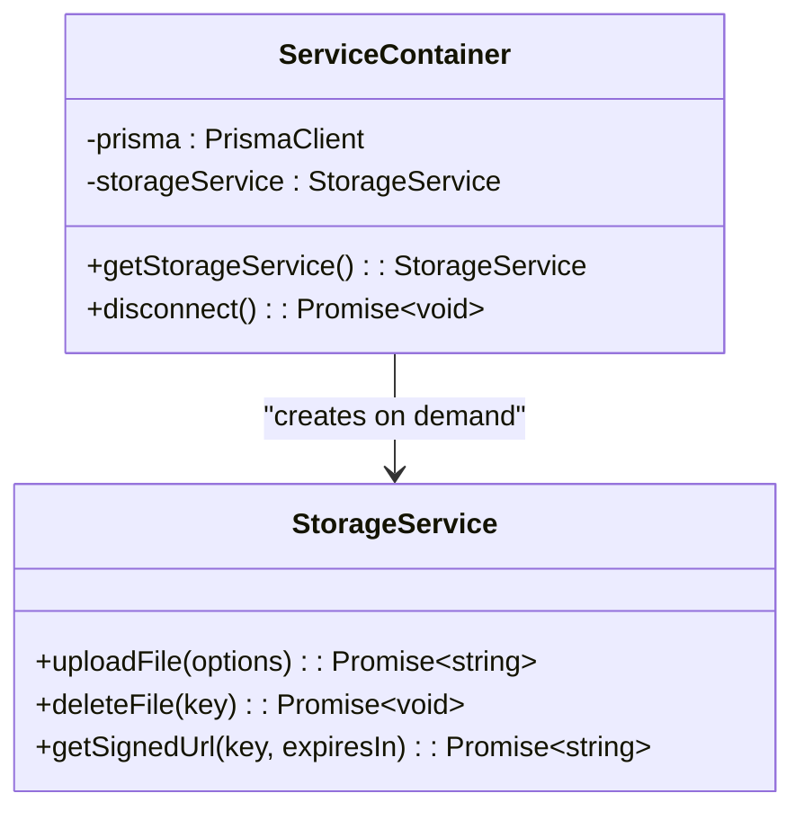
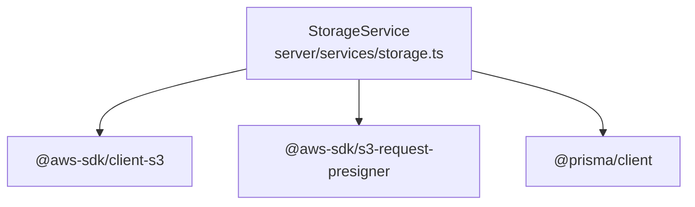

# Storage Service Implementation

<cite>
**Referenced Files in This Document**
- [storage.ts](file://server/services/storage.ts)
- [index.ts](file://server/services/index.ts)
- [FOLDER-STRUCTURE.md](file://docs/FOLDER-STRUCTURE.md)
- [package.json](file://package.json)
- [portfolio.ts](file://server/routers/portfolio.ts)
- [SETUP.md](file://SETUP.md)
- [IMPLEMENTATION_SUMMARY.md](file://IMPLEMENTATION_SUMMARY.md)
</cite>

## Table of Contents
1. [Introduction](#introduction)
2. [Project Structure](#project-structure)
3. [Core Components](#core-components)
4. [Architecture Overview](#architecture-overview)
5. [Detailed Component Analysis](#detailed-component-analysis)
6. [Dependency Analysis](#dependency-analysis)
7. [Performance Considerations](#performance-considerations)
8. [Troubleshooting Guide](#troubleshooting-guide)
9. [Conclusion](#conclusion)
10. [Appendices](#appendices)

## Introduction
This document provides comprehensive documentation for Smartfolio's Storage Service implementation. It explains the StorageService class architecture, AWS S3 integration, and file management workflows. The documentation covers upload processes, file validation, storage optimization, access control, security policies, file lifecycle management, storage scaling, backup strategies, and cost optimization techniques. Practical examples demonstrate file uploads, image processing, and CDN integration.

## Project Structure
Smartfolio follows a workspace-first architecture with a clear separation between frontend and backend. The storage service resides in the server layer and integrates with AWS S3 for object storage. The service container manages singleton instances of all backend services, including StorageService.

**Diagram sources**
- [FOLDER-STRUCTURE.md](file://docs/FOLDER-STRUCTURE.md#L209-L210)
- [index.ts](file://server/services/index.ts#L9-L118)
- [storage.ts](file://server/services/storage.ts#L1-L170)

**Section sources**
- [FOLDER-STRUCTURE.md](file://docs/FOLDER-STRUCTURE.md#L1-L254)
- [package.json](file://package.json#L16-L38)

## Core Components
The StorageService class encapsulates all S3-related operations, including file uploads, deletions, signed URL generation, and specialized handlers for portfolio images and user avatars. It also provides validation utilities for image types and sizes.

Key responsibilities:
- Initialize S3 client with region, credentials, and bucket
- Upload files with configurable metadata
- Delete files by key
- Generate signed URLs for temporary access
- Manage portfolio image and avatar storage with structured keys
- Validate image content types and sizes
- Integrate with Prisma for user avatar updates

**Section sources**
- [storage.ts](file://server/services/storage.ts#L19-L170)

## Architecture Overview
The storage architecture leverages AWS S3 as the primary object storage layer. The service container initializes StorageService with environment-provided credentials and bucket configuration. tRPC routers orchestrate requests and delegate file operations to StorageService.

**Diagram sources**
- [portfolio.ts](file://server/routers/portfolio.ts#L1-L115)
- [index.ts](file://server/services/index.ts#L76-L89)
- [storage.ts](file://server/services/storage.ts#L84-L107)

## Detailed Component Analysis

### StorageService Class
The StorageService class provides a cohesive interface for S3 operations with built-in validation and Prisma integration.

**Diagram sources**
- [storage.ts](file://server/services/storage.ts#L5-L170)

#### Upload Workflow
The upload workflow handles file ingestion, metadata attachment, and URL generation.

**Diagram sources**
- [storage.ts](file://server/services/storage.ts#L36-L54)
- [storage.ts](file://server/services/storage.ts#L156-L169)

#### Image Validation
The service enforces strict validation for image uploads to ensure compatibility and prevent oversized files.

Validation criteria:
- Supported content types: JPEG, PNG, WebP, GIF
- Maximum file size: 5MB by default
- Filename sanitization for safe S3 keys

**Section sources**
- [storage.ts](file://server/services/storage.ts#L156-L169)
- [storage.ts](file://server/services/storage.ts#L146-L154)

#### File Lifecycle Management
The service supports complete file lifecycle management including creation, access via signed URLs, and deletion.

**Diagram sources**
- [storage.ts](file://server/services/storage.ts#L36-L82)
- [storage.ts](file://server/services/storage.ts#L133-L144)

**Section sources**
- [storage.ts](file://server/services/storage.ts#L36-L82)
- [storage.ts](file://server/services/storage.ts#L133-L144)

### Service Container Integration
The service container manages StorageService as a singleton, initializing it with environment variables for AWS configuration.

**Diagram sources**
- [index.ts](file://server/services/index.ts#L76-L89)

**Section sources**
- [index.ts](file://server/services/index.ts#L76-L89)

### CDN Integration
The service generates public URLs that integrate seamlessly with AWS CloudFront or S3 static website hosting. These URLs serve as the canonical CDN endpoints for stored assets.

Integration benefits:
- Global content delivery
- SSL/TLS termination
- Edge caching optimization
- Reduced origin load

**Section sources**
- [storage.ts](file://server/services/storage.ts#L48-L50)

## Dependency Analysis
The StorageService relies on AWS SDK v3 for S3 operations and integrates with Prisma for user data updates.

**Diagram sources**
- [package.json](file://package.json#L17-L18)
- [storage.ts](file://server/services/storage.ts#L1-L3)

**Section sources**
- [package.json](file://package.json#L16-L38)

## Performance Considerations
Storage optimization strategies for production deployments:

- **Object Key Design**: Use hierarchical keys for efficient listing and lifecycle management
- **Metadata Utilization**: Store ownership and type metadata for access control and cleanup
- **CDN Caching**: Leverage browser and CDN caching with appropriate cache headers
- **Batch Operations**: Consider multipart uploads for large files to improve reliability
- **Connection Pooling**: Reuse S3 client instances through the service container

[No sources needed since this section provides general guidance]

## Troubleshooting Guide
Common issues and resolutions for the Storage Service:

- **Authentication Failures**: Verify AWS credentials and bucket permissions in environment variables
- **Upload Errors**: Check file size limits and supported content types
- **Permission Denied**: Ensure IAM policies allow S3:PutObject, S3:GetObject, S3:DeleteObject
- **Invalid URLs**: Confirm bucket name and region configuration match deployment

**Section sources**
- [SETUP.md](file://SETUP.md#L128-L141)
- [IMPLEMENTATION_SUMMARY.md](file://IMPLEMENTATION_SUMMARY.md#L233-L233)

## Conclusion
Smartfolio's Storage Service provides a robust foundation for file management using AWS S3. The implementation emphasizes type safety, validation, and integration with the broader application architecture. The modular design enables easy maintenance and extension while leveraging cloud-native capabilities for scalability and performance.

## Appendices

### Environment Configuration
Required environment variables for StorageService:
- AWS_REGION: S3 region deployment
- AWS_ACCESS_KEY_ID: IAM access key
- AWS_SECRET_ACCESS_KEY: IAM secret key
- AWS_S3_BUCKET: Target S3 bucket name

**Section sources**
- [index.ts](file://server/services/index.ts#L80-L83)
- [SETUP.md](file://SETUP.md#L128-L141)

### Security Best Practices
- Use IAM roles with least privilege for S3 access
- Enable server-side encryption for S3 buckets
- Implement signed URLs for temporary access
- Regularly audit bucket policies and access logs
- Monitor upload patterns for abuse detection

[No sources needed since this section provides general guidance]