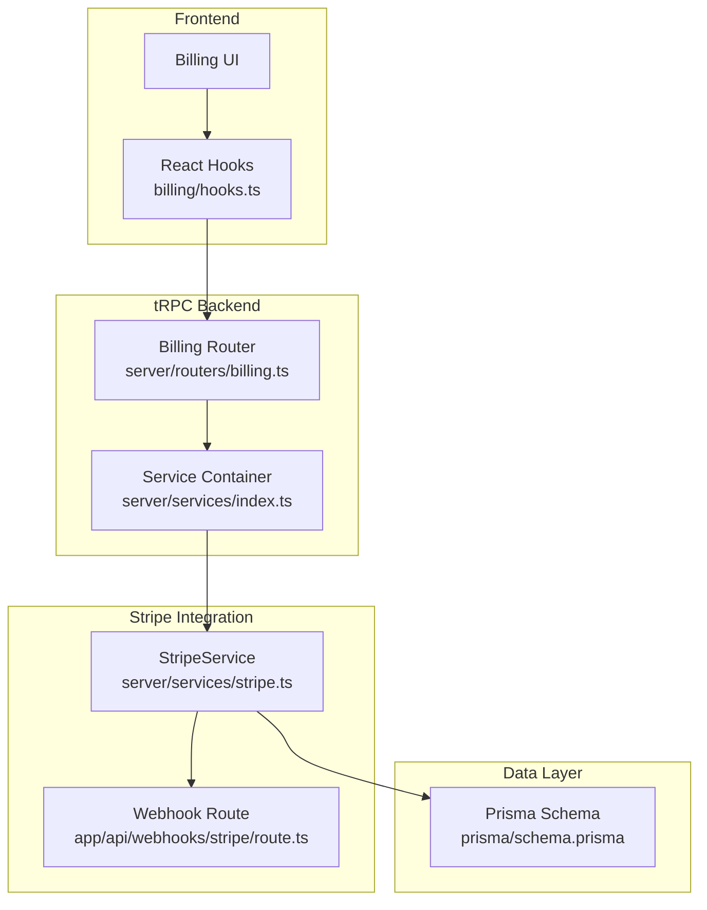
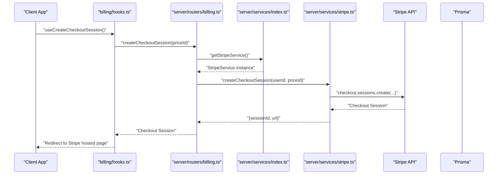
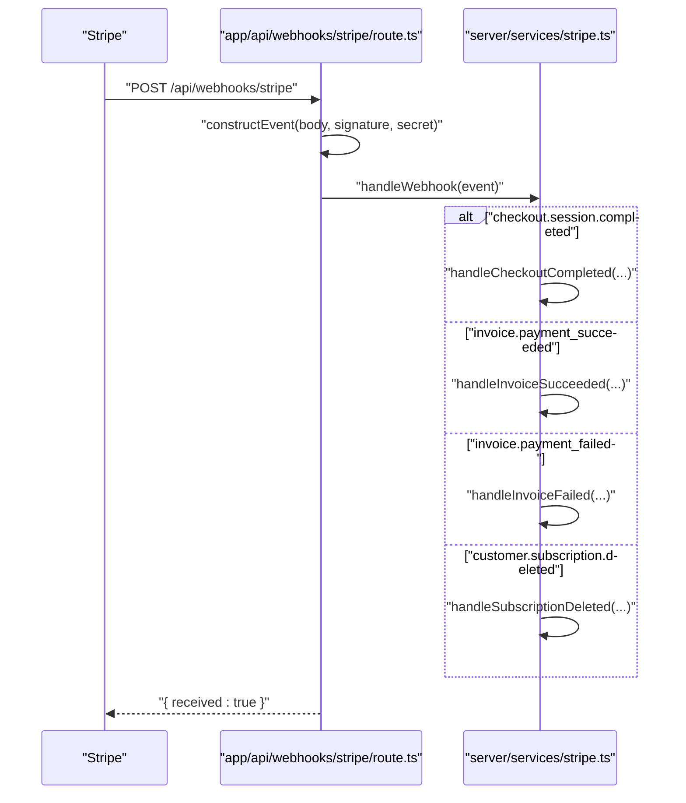
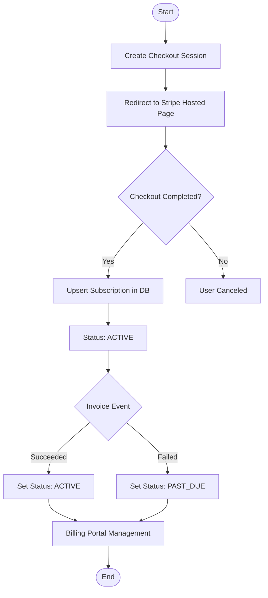
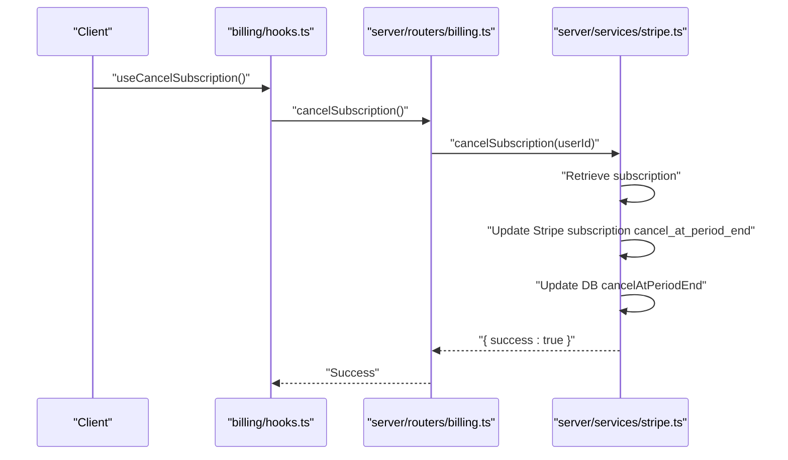
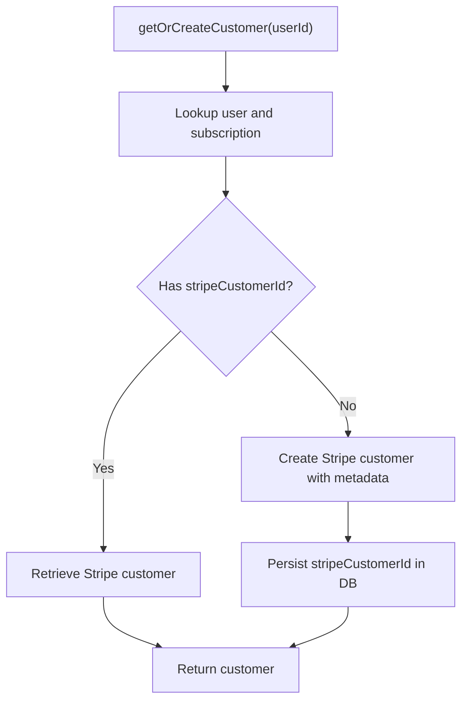
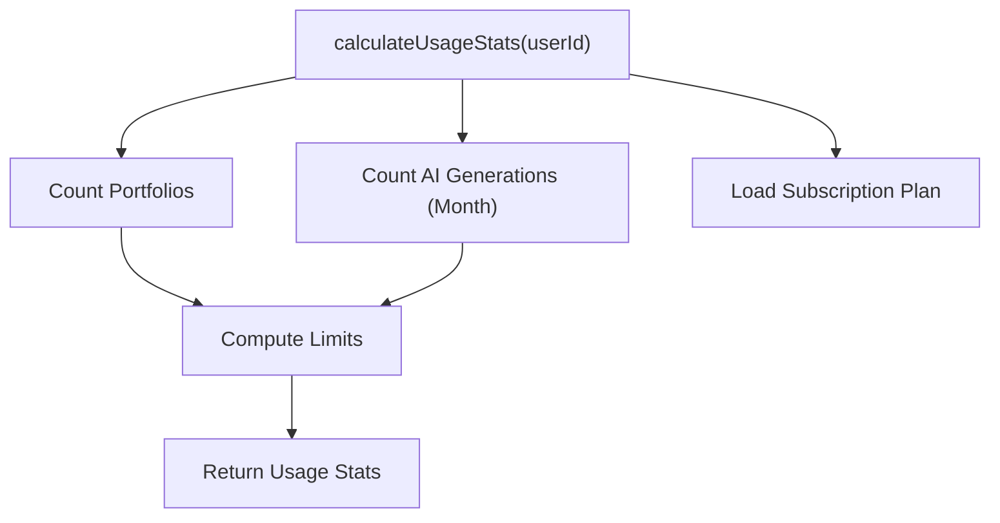
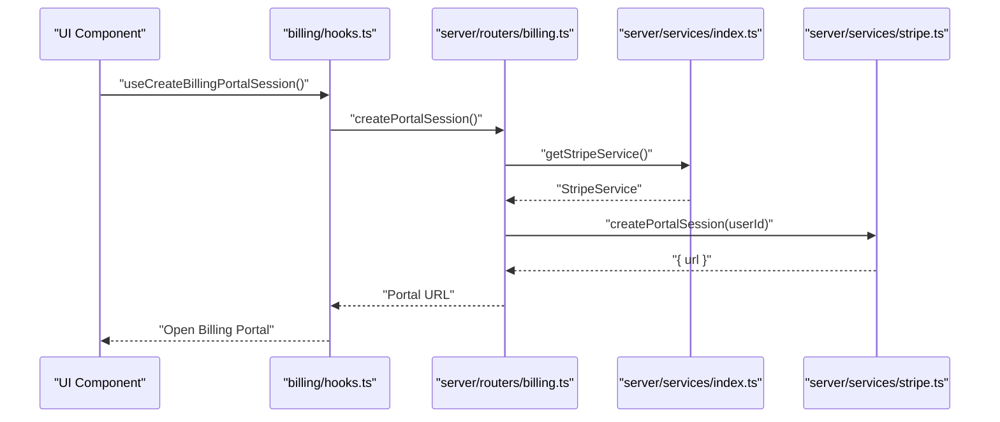
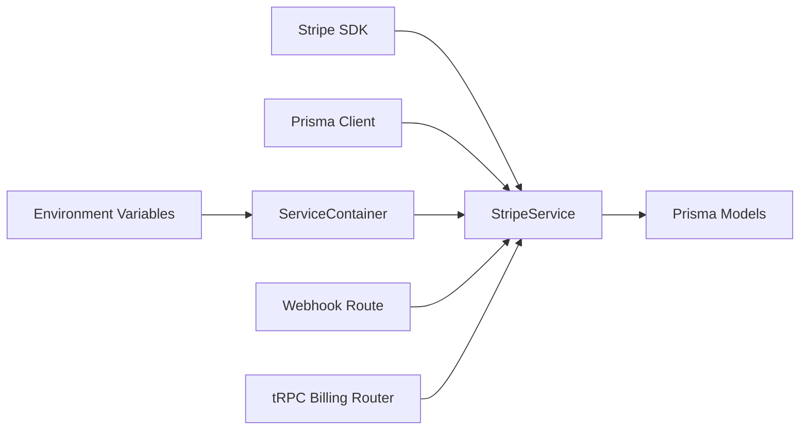

# Stripe Payment Service

<cite>
**Referenced Files in This Document**
- [stripe.ts](file://server/services/stripe.ts)
- [route.ts](file://app/api/webhooks/stripe/route.ts)
- [index.ts](file://server/services/index.ts)
- [types.ts](file://modules/billing/types.ts)
- [constants.ts](file://modules/billing/constants.ts)
- [utils.ts](file://modules/billing/utils.ts)
- [billing.ts](file://server/routers/billing.ts)
- [hooks.ts](file://modules/billing/hooks.ts)
- [schema.prisma](file://prisma/schema.prisma)
</cite>

## Table of Contents
1. [Introduction](#introduction)
2. [Project Structure](#project-structure)
3. [Core Components](#core-components)
4. [Architecture Overview](#architecture-overview)
5. [Detailed Component Analysis](#detailed-component-analysis)
6. [Dependency Analysis](#dependency-analysis)
7. [Performance Considerations](#performance-considerations)
8. [Troubleshooting Guide](#troubleshooting-guide)
9. [Conclusion](#conclusion)
10. [Appendices](#appendices)

## Introduction
This document provides comprehensive documentation for Smartfolio’s Stripe Payment Service implementation. It explains the StripeService class structure, payment processing workflows, subscription lifecycle management, webhook handling, customer management, and integration with the tRPC backend. It also covers practical scenarios such as subscription billing, payment failures, and refund processing, along with Stripe API integration, webhook security, reconciliation processes, PCI compliance considerations, fraud prevention, and payment analytics.

## Project Structure
Smartfolio integrates Stripe via a dedicated service layer, a tRPC router for frontend interactions, and a webhook endpoint for asynchronous events. The billing module defines types, constants, and utilities for plan management and quota calculations. Prisma models represent persisted billing data.



**Diagram sources**
- [hooks.ts](file://modules/billing/hooks.ts#L1-L91)
- [billing.ts](file://server/routers/billing.ts#L1-L71)
- [index.ts](file://server/services/index.ts#L1-L118)
- [stripe.ts](file://server/services/stripe.ts#L1-L294)
- [route.ts](file://app/api/webhooks/stripe/route.ts#L1-L38)
- [schema.prisma](file://prisma/schema.prisma#L172-L208)

**Section sources**
- [hooks.ts](file://modules/billing/hooks.ts#L1-L91)
- [billing.ts](file://server/routers/billing.ts#L1-L71)
- [index.ts](file://server/services/index.ts#L1-L118)
- [stripe.ts](file://server/services/stripe.ts#L1-L294)
- [route.ts](file://app/api/webhooks/stripe/route.ts#L1-L38)
- [schema.prisma](file://prisma/schema.prisma#L172-L208)

## Core Components
- StripeService: Central class managing Stripe operations including checkout sessions, billing portal sessions, subscription lifecycle, webhook handling, and usage statistics.
- StripeServiceConfig: Configuration interface for API keys and price IDs.
- Webhook Route: Validates Stripe signatures and forwards events to StripeService.
- tRPC Billing Router: Exposes protected procedures for frontend interactions (checkout, portal, cancellation, resumption, payment history, usage stats).
- Billing Types and Constants: Define subscription plans, statuses, payment statuses, plan features, and Stripe configuration.
- Prisma Models: Persist subscriptions, payments, and related metadata.

**Section sources**
- [stripe.ts](file://server/services/stripe.ts#L4-L22)
- [route.ts](file://app/api/webhooks/stripe/route.ts#L6-L38)
- [billing.ts](file://server/routers/billing.ts#L5-L70)
- [types.ts](file://modules/billing/types.ts#L5-L84)
- [constants.ts](file://modules/billing/constants.ts#L7-L81)
- [schema.prisma](file://prisma/schema.prisma#L172-L208)

## Architecture Overview
The system follows a layered architecture:
- Presentation: React hooks and UI components trigger tRPC procedures.
- Application: tRPC router delegates to the Service Container, which instantiates StripeService.
- Integration: StripeService interacts with Stripe APIs and persists state via Prisma.
- Events: Stripe webhook endpoint validates signatures and invokes StripeService handlers.



**Diagram sources**
- [hooks.ts](file://modules/billing/hooks.ts#L20-L29)
- [billing.ts](file://server/routers/billing.ts#L16-L30)
- [index.ts](file://server/services/index.ts#L38-L52)
- [stripe.ts](file://server/services/stripe.ts#L24-L52)

## Detailed Component Analysis

### StripeService Class
StripeService encapsulates all Stripe-related operations and maintains internal state for configuration and persistence.

```mermaid
classDiagram
class StripeService {
-stripe : Stripe
-prisma : PrismaClient
-config : StripeServiceConfig
+constructor(config, prisma)
+createCheckoutSession(userId, priceId) Promise~{sessionId, url}~
+createPortalSession(userId) Promise~{url}~
+cancelSubscription(userId) Promise~{success}~
+resumeSubscription(userId) Promise~{success}~
+handleWebhook(event) Promise~void~
+calculateUsageStats(userId) Promise~UsageStats~
-getOrCreateCustomer(userId) Promise~Customer~
-handleCheckoutCompleted(session) Promise~void~
-handleInvoiceSucceeded(invoice) Promise~void~
-handleInvoiceFailed(invoice) Promise~void~
-handleSubscriptionDeleted(subscription) Promise~void~
}
class StripeServiceConfig {
+apiKey : string
+webhookSecret : string
+priceIds : PriceIds
}
class PriceIds {
+pro : string
+enterprise : string
}
StripeService --> StripeServiceConfig : "uses"
```

**Diagram sources**
- [stripe.ts](file://server/services/stripe.ts#L13-L294)
- [types.ts](file://modules/billing/types.ts#L26-L40)

Key responsibilities:
- Checkout session creation with customer linkage and metadata.
- Billing portal session generation for customer self-service.
- Subscription lifecycle management (cancel/resume).
- Webhook event routing and state synchronization.
- Usage statistics calculation for quotas.
- Customer creation/retrieval and Stripe customer ID persistence.

Operational highlights:
- Uses Stripe SDK for checkout sessions, billing portal, and subscription updates.
- Persists Stripe identifiers and subscription periods in Prisma.
- Handles webhook events for successful payments, failed payments, and subscription deletions.

**Section sources**
- [stripe.ts](file://server/services/stripe.ts#L13-L294)
- [types.ts](file://modules/billing/types.ts#L26-L40)

### Webhook Handling Workflow
The webhook endpoint validates signatures and delegates events to StripeService handlers.



**Diagram sources**
- [route.ts](file://app/api/webhooks/stripe/route.ts#L6-L38)
- [stripe.ts](file://server/services/stripe.ts#L115-L130)
- [stripe.ts](file://server/services/stripe.ts#L211-L293)

Security considerations:
- Validates Stripe signature header before processing.
- Uses configured webhook secret for event construction.
- Returns structured errors on validation failure.

**Section sources**
- [route.ts](file://app/api/webhooks/stripe/route.ts#L6-L38)
- [stripe.ts](file://server/services/stripe.ts#L115-L130)
- [stripe.ts](file://server/services/stripe.ts#L211-L293)

### Payment Processing Workflows
- Checkout session creation links a user to a Stripe customer and initiates a subscription checkout.
- On completion, StripeService upserts subscription records with plan, pricing, and period details.
- Invoice events update subscription status (active/past_due).
- Billing portal allows customers to manage payment methods and subscription details.



**Diagram sources**
- [stripe.ts](file://server/services/stripe.ts#L24-L52)
- [stripe.ts](file://server/services/stripe.ts#L211-L248)
- [stripe.ts](file://server/services/stripe.ts#L250-L280)
- [stripe.ts](file://server/services/stripe.ts#L54-L65)

**Section sources**
- [stripe.ts](file://server/services/stripe.ts#L24-L52)
- [stripe.ts](file://server/services/stripe.ts#L211-L248)
- [stripe.ts](file://server/services/stripe.ts#L250-L280)
- [stripe.ts](file://server/services/stripe.ts#L54-L65)

### Subscription Management
- Cancel at period end: Updates Stripe subscription and local status.
- Resume subscription: Reverses cancellation at period end and syncs status.
- Plan determination: Derived from price ID comparison against configured price IDs.



**Diagram sources**
- [hooks.ts](file://modules/billing/hooks.ts#L42-L56)
- [billing.ts](file://server/routers/billing.ts#L39-L44)
- [stripe.ts](file://server/services/stripe.ts#L67-L89)

**Section sources**
- [stripe.ts](file://server/services/stripe.ts#L67-L113)
- [hooks.ts](file://modules/billing/hooks.ts#L42-L72)
- [billing.ts](file://server/routers/billing.ts#L39-L51)

### Customer Management
- Ensures a Stripe customer exists per user and persists the Stripe customer ID in the subscription record.
- Retrieves existing customer if present; otherwise creates a new customer with metadata.



**Diagram sources**
- [stripe.ts](file://server/services/stripe.ts#L172-L209)

**Section sources**
- [stripe.ts](file://server/services/stripe.ts#L172-L209)

### Usage Statistics and Quotas
- Calculates usage counts for portfolios and AI generations within the current billing period.
- Determines plan limits and exposes remaining quota for features.



**Diagram sources**
- [stripe.ts](file://server/services/stripe.ts#L132-L170)

**Section sources**
- [stripe.ts](file://server/services/stripe.ts#L132-L170)
- [utils.ts](file://modules/billing/utils.ts#L40-L54)

### Frontend Integration
- React hooks wrap tRPC procedures for checkout, portal, cancellation, resumption, payment history, and usage stats.
- tRPC router enforces authentication and delegates to StripeService.



**Diagram sources**
- [hooks.ts](file://modules/billing/hooks.ts#L31-L40)
- [billing.ts](file://server/routers/billing.ts#L32-L37)
- [index.ts](file://server/services/index.ts#L38-L52)
- [stripe.ts](file://server/services/stripe.ts#L54-L65)

**Section sources**
- [hooks.ts](file://modules/billing/hooks.ts#L1-L91)
- [billing.ts](file://server/routers/billing.ts#L1-L71)
- [index.ts](file://server/services/index.ts#L1-L118)
- [stripe.ts](file://server/services/stripe.ts#L54-L65)

## Dependency Analysis
- StripeService depends on Stripe SDK, Prisma Client, and configuration.
- ServiceContainer lazily initializes StripeService with environment variables.
- tRPC billing router depends on ServiceContainer and Prisma for queries.
- Webhook route depends on Stripe SDK and ServiceContainer.
- Prisma models define relationships between User, Subscription, and Payment.



**Diagram sources**
- [index.ts](file://server/services/index.ts#L38-L52)
- [stripe.ts](file://server/services/stripe.ts#L1-L22)
- [route.ts](file://app/api/webhooks/stripe/route.ts#L18-L26)
- [billing.ts](file://server/routers/billing.ts#L1-L71)
- [schema.prisma](file://prisma/schema.prisma#L172-L208)

**Section sources**
- [index.ts](file://server/services/index.ts#L1-L118)
- [stripe.ts](file://server/services/stripe.ts#L1-L22)
- [route.ts](file://app/api/webhooks/stripe/route.ts#L1-L38)
- [billing.ts](file://server/routers/billing.ts#L1-L71)
- [schema.prisma](file://prisma/schema.prisma#L172-L208)

## Performance Considerations
- Minimize external API calls: Cache Stripe customer retrieval when possible.
- Batch operations: Consolidate subscription updates where feasible.
- Indexing: Ensure Prisma indexes on frequently queried fields (userId, status, stripe identifiers).
- Asynchronous processing: Webhooks are inherently asynchronous; avoid long-running synchronous work in webhook handlers.
- Rate limiting: Consider upstream rate limits from Stripe and implement client-side throttling for repeated mutations.

## Troubleshooting Guide
Common issues and resolutions:
- Missing Stripe signature: Webhook route returns a 400 error when signature is absent. Verify webhook endpoint configuration in Stripe Dashboard.
- Invalid webhook secret: Ensure the webhook secret matches the environment variable used by the webhook route.
- No active subscription found during cancellation/resumption: Validate that the user has an associated subscription record with a Stripe subscription ID.
- Payment failures: Invoice failure events set subscription status to past_due; ensure retry logic and communication with the user.
- Customer not found: The getOrCreateCustomer method handles missing customers; verify user and subscription records exist.

**Section sources**
- [route.ts](file://app/api/webhooks/stripe/route.ts#L11-L16)
- [route.ts](file://app/api/webhooks/stripe/route.ts#L31-L36)
- [stripe.ts](file://server/services/stripe.ts#L67-L74)
- [stripe.ts](file://server/services/stripe.ts#L266-L280)
- [stripe.ts](file://server/services/stripe.ts#L172-L209)

## Conclusion
Smartfolio’s Stripe Payment Service provides a robust, modular integration with Stripe, covering checkout, billing portal, subscription lifecycle, and webhook-driven reconciliation. The implementation leverages tRPC for frontend-backend communication, Prisma for persistent state, and strict webhook validation for security. The system supports practical scenarios like subscription billing, payment failures, and usage-based quotas while maintaining clear separation of concerns and extensibility for future enhancements.

## Appendices

### Practical Scenarios

- Subscription Billing
  - Create a checkout session with a specific price ID.
  - On completion, StripeService upserts subscription details and sets status to active.
  - Invoice events update status accordingly.

  **Section sources**
  - [stripe.ts](file://server/services/stripe.ts#L24-L52)
  - [stripe.ts](file://server/services/stripe.ts#L211-L248)
  - [stripe.ts](file://server/services/stripe.ts#L250-L264)

- Payment Failures
  - Invoice failure events set subscription status to past_due.
  - Implement notification and retry mechanisms at the application level.

  **Section sources**
  - [stripe.ts](file://server/services/stripe.ts#L266-L280)

- Refund Processing
  - Stripe refunds are handled by Stripe; Smartfolio does not currently implement explicit refund creation in the service.
  - Track refund status via Stripe events and synchronize with Payment model status if extended.

  **Section sources**
  - [types.ts](file://modules/billing/types.ts#L42-L52)
  - [schema.prisma](file://prisma/schema.prisma#L193-L208)

- Stripe API Integration
  - Publishable key and price IDs are configured via environment variables.
  - Webhook secret and API key are used for secure event handling.

  **Section sources**
  - [constants.ts](file://modules/billing/constants.ts#L65-L69)
  - [constants.ts](file://modules/billing/constants.ts#L73-L81)
  - [index.ts](file://server/services/index.ts#L40-L49)
  - [route.ts](file://app/api/webhooks/stripe/route.ts#L20-L26)

- Webhook Security
  - Signature verification prevents tampering.
  - Only configured webhook secret is used for event construction.

  **Section sources**
  - [route.ts](file://app/api/webhooks/stripe/route.ts#L18-L26)

- Reconciliation Processes
  - Webhook handlers reconcile Stripe events with local subscription/payment records.
  - Usage statistics are calculated periodically or on demand.

  **Section sources**
  - [stripe.ts](file://server/services/stripe.ts#L115-L130)
  - [stripe.ts](file://server/services/stripe.ts#L132-L170)

- PCI Compliance and Fraud Prevention
  - Stripe handles card collection and PCI compliance; Smartfolio does not store sensitive card data.
  - Consider implementing Stripe Radar or other fraud detection features at the Stripe dashboard level.
  - Use Stripe’s 3D Secure and other authentication features as needed.

- Payment Analytics
  - Payment history is stored and retrievable via tRPC queries.
  - Usage statistics inform quota enforcement and reporting.

  **Section sources**
  - [billing.ts](file://server/routers/billing.ts#L53-L62)
  - [stripe.ts](file://server/services/stripe.ts#L132-L170)
  - [utils.ts](file://modules/billing/utils.ts#L85-L102)