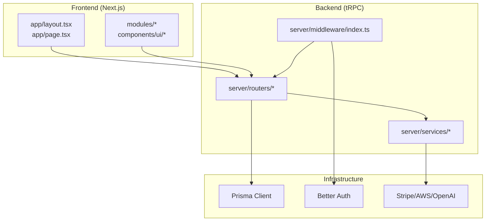
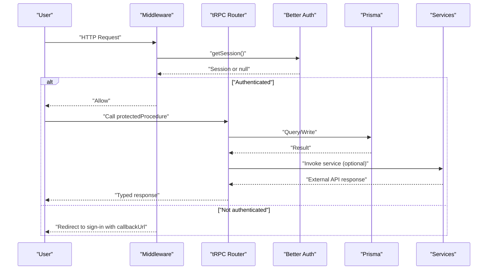
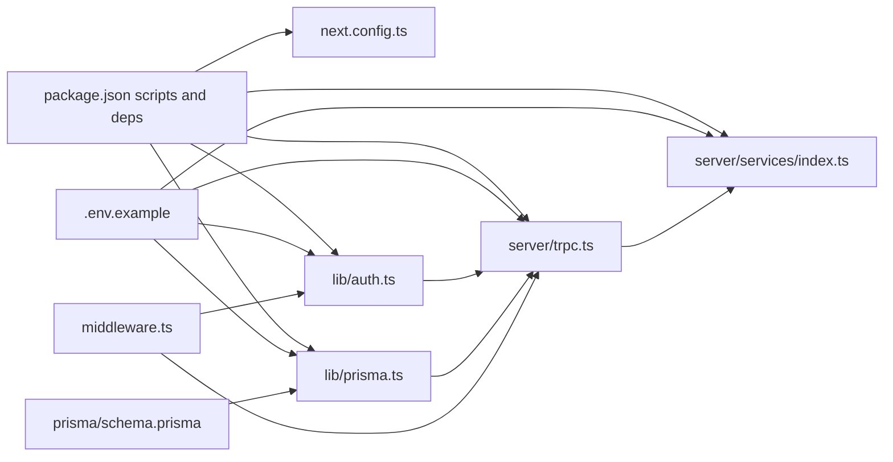

# Troubleshooting and FAQ

<cite>
**Referenced Files in This Document**
- [README.md](file://README.md)
- [SETUP.md](file://SETUP.md)
- [package.json](file://package.json)
- [.env.example](file://.env.example)
- [prisma/schema.prisma](file://prisma/schema.prisma)
- [lib/auth.ts](file://lib/auth.ts)
- [lib/prisma.ts](file://lib/prisma.ts)
- [middleware.ts](file://middleware.ts)
- [server/trpc.ts](file://server/trpc.ts)
- [server/services/index.ts](file://server/services/index.ts)
- [modules/auth/hooks.ts](file://modules/auth/hooks.ts)
- [.next/required-server-files.json](file://.next/required-server-files.json)
</cite>

## Table of Contents
1. [Introduction](#introduction)
2. [Project Structure](#project-structure)
3. [Core Components](#core-components)
4. [Architecture Overview](#architecture-overview)
5. [Detailed Component Analysis](#detailed-component-analysis)
6. [Dependency Analysis](#dependency-analysis)
7. [Performance Considerations](#performance-considerations)
8. [Troubleshooting Guide](#troubleshooting-guide)
9. [FAQ](#faq)
10. [Conclusion](#conclusion)

## Introduction
This document provides a comprehensive troubleshooting and FAQ guide for Smartfolio. It covers setup, development, and deployment issues; authentication problems; database connectivity; API integration failures; performance bottlenecks; platform-specific considerations; diagnostic procedures; log analysis; and preventive measures. It also answers frequent questions about project structure, feature limitations, and customization possibilities.

## Project Structure
Smartfolio follows a modular architecture:
- Frontend: Next.js App Router under app/
- Backend: tRPC routers and services under server/
- Modules: Feature-focused code under modules/
- Utilities: Authentication, Prisma client, tRPC provider under lib/
- Database: Prisma schema under prisma/

**Diagram sources**
- [SETUP.md](file://SETUP.md#L37-L85)
- [lib/prisma.ts](file://lib/prisma.ts#L1-L14)
- [lib/auth.ts](file://lib/auth.ts#L1-L25)
- [server/trpc.ts](file://server/trpc.ts#L1-L61)
- [server/services/index.ts](file://server/services/index.ts#L1-L118)

**Section sources**
- [SETUP.md](file://SETUP.md#L37-L85)
- [README.md](file://README.md#L1-L58)

## Core Components
- Authentication: Better Auth configured with email/password and optional OAuth providers, integrated with Prisma adapter.
- Database: Prisma Client with PostgreSQL datasource.
- API Layer: tRPC with protected/public procedures and context injection.
- Services: AI, Stripe, Email, Storage, and rate limiting via Upstash Redis.
- Middleware: Route protection and redirection logic.

**Section sources**
- [lib/auth.ts](file://lib/auth.ts#L1-L25)
- [lib/prisma.ts](file://lib/prisma.ts#L1-L14)
- [server/trpc.ts](file://server/trpc.ts#L1-L61)
- [server/services/index.ts](file://server/services/index.ts#L1-L118)
- [middleware.ts](file://middleware.ts#L1-L95)

## Architecture Overview
The system enforces authentication at the middleware level and exposes type-safe APIs via tRPC. Services encapsulate integrations with external providers.

**Diagram sources**
- [middleware.ts](file://middleware.ts#L28-L81)
- [server/trpc.ts](file://server/trpc.ts#L12-L61)
- [lib/auth.ts](file://lib/auth.ts#L1-L25)
- [lib/prisma.ts](file://lib/prisma.ts#L1-L14)
- [server/services/index.ts](file://server/services/index.ts#L1-L118)

## Detailed Component Analysis

### Authentication Troubleshooting
Common symptoms:
- Redirect loops to sign-in
- OAuth login fails silently
- Session not persisting across pages

Diagnostic steps:
- Verify environment variables for Better Auth and OAuth providers.
- Confirm base URL matches deployment URL.
- Check cookies and session endpoint availability.
- Inspect tRPC context for session presence.

Resolution steps:
- Ensure BETTER_AUTH_SECRET is at least 32 characters.
- Set BETTER_AUTH_URL to the public app URL.
- Provide valid GOOGLE_CLIENT_ID/SECRET or GITHUB_CLIENT_ID/SECRET if enabling OAuth.
- Confirm cookies are not blocked by SameSite or HTTPS policies.

Preventive measures:
- Use HTTPS in production and set appropriate cookie security flags.
- Keep BETTER_AUTH_URL consistent across frontend and backend.
- Validate OAuth callback URLs in provider dashboards.

**Section sources**
- [.env.example](file://.env.example#L1-L84)
- [lib/auth.ts](file://lib/auth.ts#L1-L25)
- [middleware.ts](file://middleware.ts#L28-L81)
- [modules/auth/hooks.ts](file://modules/auth/hooks.ts#L1-L29)

### Database Connectivity Troubleshooting
Common symptoms:
- Prisma Client connection errors
- Migration failures
- Slow queries in development

Diagnostic steps:
- Confirm DATABASE_URL format and credentials.
- Verify PostgreSQL is reachable from the host.
- Check Prisma Client logs in development mode.
- Validate Prisma schema and generated client.

Resolution steps:
- Fix connection string format and credentials.
- Ensure the database server allows connections from the host.
- Re-run Prisma client generation and schema push/migrate.
- Review slow query logs and add missing indexes if needed.

Preventive measures:
- Use strong passwords and limit network exposure.
- Keep Prisma client and schema synchronized.
- Monitor connection pool limits and timeouts.

**Section sources**
- [.env.example](file://.env.example#L4-L4)
- [lib/prisma.ts](file://lib/prisma.ts#L1-L14)
- [prisma/schema.prisma](file://prisma/schema.prisma#L1-L230)
- [SETUP.md](file://SETUP.md#L145-L150)

### API Integration Failures (tRPC, Stripe, AI, Email, Storage)
Common symptoms:
- tRPC UNAUTHORIZED errors
- Stripe webhook signature verification failures
- AI provider API quota exceeded or invalid keys
- Email delivery failures
- S3 upload/download errors

Diagnostic steps:
- Inspect tRPC error formatter output for Zod errors.
- Verify Stripe webhook secrets and signing keys.
- Check AI provider API keys and quotas.
- Validate SMTP settings or alternative provider keys.
- Confirm AWS credentials and bucket permissions.

Resolution steps:
- Provide valid OPENAI_API_KEY and optional Anthropic/Google AI keys.
- Set STRIPE_SECRET_KEY, STRIPE_WEBHOOK_SECRET, and price IDs.
- Configure SMTP or use RESEND_API_KEY for transactional emails.
- Supply AWS_ACCESS_KEY_ID, AWS_SECRET_ACCESS_KEY, AWS_S3_BUCKET, and AWS_REGION.
- Re-check Upstash Redis URL and token for rate limiting.

Preventive measures:
- Store secrets in .env and avoid committing them.
- Use environment-specific configurations for local vs prod.
- Implement retry/backoff for transient failures.

**Section sources**
- [server/trpc.ts](file://server/trpc.ts#L29-L39)
- [server/services/index.ts](file://server/services/index.ts#L25-L103)
- [.env.example](file://.env.example#L24-L84)

### Performance Bottlenecks
Common symptoms:
- Slow page loads
- High tRPC latency
- Database query slowness
- Excessive memory usage

Diagnostic steps:
- Enable Next.js logging and profiling.
- Monitor Prisma query logs in development.
- Profile tRPC procedures and service calls.
- Check Redis rate limiting overhead.

Resolution steps:
- Add indexes for frequent filters and joins.
- Optimize tRPC transformers and payload sizes.
- Tune Upstash Redis sliding window settings.
- Reduce unnecessary re-renders and heavy computations.

Preventive measures:
- Keep Prisma schema normalized and indexed.
- Use pagination and caching where appropriate.
- Monitor resource usage in CI and staging.

**Section sources**
- [.next/required-server-files.json](file://.next/required-server-files.json#L1-L320)
- [lib/prisma.ts](file://lib/prisma.ts#L10-L10)
- [server/services/index.ts](file://server/services/index.ts#L91-L103)

## Dependency Analysis

**Diagram sources**
- [package.json](file://package.json#L1-L52)
- [next.config.ts](file://next.config.ts#L1-L8)
- [.env.example](file://.env.example#L1-L84)
- [prisma/schema.prisma](file://prisma/schema.prisma#L1-L230)
- [lib/auth.ts](file://lib/auth.ts#L1-L25)
- [lib/prisma.ts](file://lib/prisma.ts#L1-L14)
- [server/trpc.ts](file://server/trpc.ts#L1-L61)
- [server/services/index.ts](file://server/services/index.ts#L1-L118)
- [middleware.ts](file://middleware.ts#L1-L95)

**Section sources**
- [package.json](file://package.json#L1-L52)
- [SETUP.md](file://SETUP.md#L199-L210)

## Performance Considerations
- Logging: Development logs include Prisma query traces; adjust NODE_ENV to reduce noise in production.
- Caching: Use tRPC transformer and consider caching for repeated reads.
- Database: Add indexes for filtered queries; avoid N+1 by batching relations.
- External APIs: Implement retries and circuit breakers for AI/email/storage.
- Middleware: Keep redirect logic minimal and delegate heavy checks to tRPC procedures.

[No sources needed since this section provides general guidance]

## Troubleshooting Guide

### Setup Phase
Symptoms:
- Cannot start dev server
- Missing environment variables
- Prisma client generation fails

Steps:
- Install dependencies using the supported package manager.
- Copy .env.example to .env and fill required values.
- Generate Prisma client and push schema to the database.
- Start the development server and verify the landing page.

Resolutions:
- Use Node.js 18+ as specified in prerequisites.
- Ensure DATABASE_URL points to a running PostgreSQL instance.
- Re-run Prisma commands if schema changes occur.

**Section sources**
- [README.md](file://README.md#L19-L38)
- [SETUP.md](file://SETUP.md#L91-L158)
- [package.json](file://package.json#L5-L14)

### Development Phase
Symptoms:
- Authentication redirects loop
- Protected routes inaccessible
- tRPC UNAUTHORIZED errors

Steps:
- Confirm BETTER_AUTH_URL and secret values.
- Verify OAuth client IDs/secrets if enabled.
- Check middleware matcher and public/auth route lists.
- Inspect tRPC context creation and protectedProcedure guards.

Resolutions:
- Align BETTER_AUTH_URL with the app’s public URL.
- Ensure cookies are readable by the server.
- Adjust middleware route lists if adding new pages.

**Section sources**
- [.env.example](file://.env.example#L10-L10)
- [middleware.ts](file://middleware.ts#L4-L95)
- [server/trpc.ts](file://server/trpc.ts#L47-L61)

### Deployment Phase
Symptoms:
- Authentication fails after deployment
- Stripe webhooks not processed
- AI provider calls fail

Steps:
- Set environment variables in the deployment platform.
- Ensure BETTER_AUTH_URL points to the production domain.
- Configure Stripe webhook signing secrets and endpoints.
- Validate AI provider keys and quotas.

Resolutions:
- Use HTTPS and secure cookies in production.
- Register webhook endpoints with proper signing secrets.
- Monitor provider quotas and enable billing alerts.

**Section sources**
- [.env.example](file://.env.example#L24-L46)
- [SETUP.md](file://SETUP.md#L170-L196)

### Authentication Problems
Symptoms:
- OAuth login stuck on callback
- Session not recognized after refresh
- Email/password login failing

Steps:
- Verify provider client credentials.
- Check CORS and redirect URI configurations.
- Confirm session cookie domain/path and SameSite settings.

Resolutions:
- Match callback URLs with provider dashboards.
- Ensure cookies are accepted over HTTPS.
- Rotate BETTER_AUTH_SECRET if compromised.

**Section sources**
- [lib/auth.ts](file://lib/auth.ts#L12-L23)
- [middleware.ts](file://middleware.ts#L28-L42)

### Database Connectivity Issues
Symptoms:
- Prisma Client throws connection errors
- Migrations fail or hang

Steps:
- Validate DATABASE_URL format and credentials.
- Test connectivity from the deployment host.
- Re-generate Prisma client and re-apply migrations.

Resolutions:
- Fix credentials and firewall rules.
- Use managed databases with proper egress rules.
- Keep Prisma client and schema in sync.

**Section sources**
- [.env.example](file://.env.example#L4-L4)
- [lib/prisma.ts](file://lib/prisma.ts#L1-L14)
- [prisma/schema.prisma](file://prisma/schema.prisma#L1-L230)

### API Integration Failures
Symptoms:
- Stripe webhooks rejected
- AI provider errors
- Email delivery failures

Steps:
- Confirm Stripe secret and webhook signing secrets.
- Verify AI provider API keys and quotas.
- Check SMTP settings or switch to an external provider.

Resolutions:
- Regenerate webhook secrets and update provider dashboards.
- Upgrade plan or wait for quota resets.
- Use RESEND_API_KEY or configure SMTP properly.

**Section sources**
- [server/services/index.ts](file://server/services/index.ts#L38-L74)
- [.env.example](file://.env.example#L24-L84)

### Performance Bottlenecks
Symptoms:
- Slow page loads
- High tRPC latency
- Memory spikes

Steps:
- Enable Next.js logging and inspect traces.
- Review Prisma query logs and slow queries.
- Profile tRPC procedures and service calls.

Resolutions:
- Add missing indexes and optimize queries.
- Reduce payload sizes and leverage caching.
- Tune Upstash Redis rate limiting.

**Section sources**
- [.next/required-server-files.json](file://.next/required-server-files.json#L1-L320)
- [lib/prisma.ts](file://lib/prisma.ts#L10-L10)
- [server/services/index.ts](file://server/services/index.ts#L91-L103)

### Platform-Specific Troubleshooting
Windows:
- Ensure long path support is enabled for Next.js cache.
- Use WSL for PostgreSQL compatibility if needed.
- Avoid case-sensitive filesystem issues with environment variable casing.

macOS:
- Use Homebrew to manage Node.js and PostgreSQL versions.
- Grant firewall exceptions for local PostgreSQL.

Linux:
- Use systemd or Docker for PostgreSQL.
- Ensure timezone and locale settings match Prisma expectations.

[No sources needed since this section provides general guidance]

### Diagnostic Procedures and Log Analysis
- Next.js logs: Inspect terminal output during dev/build/start.
- Prisma logs: Development mode enables query/error/warn logs.
- tRPC errors: Use the error formatter to surface Zod validation issues.
- Middleware: Add console logs around session checks for debugging.

Tools:
- Prisma Studio for database inspection.
- Browser DevTools Network tab for API calls.
- Stripe CLI for webhook testing.

**Section sources**
- [.next/required-server-files.json](file://.next/required-server-files.json#L10-L11)
- [lib/prisma.ts](file://lib/prisma.ts#L10-L10)
- [server/trpc.ts](file://server/trpc.ts#L29-L39)

### Debugging Tools Usage
- Prisma: Use studio, generate, db push/migrate commands.
- Next.js: Use dev mode, inspect .next directory artifacts.
- Auth: Temporarily disable middleware to test routes independently.

**Section sources**
- [package.json](file://package.json#L10-L14)
- [SETUP.md](file://SETUP.md#L201-L210)

## FAQ

Q1: What are the prerequisites for running Smartfolio locally?
- Node.js 18+, PostgreSQL, and a supported package manager.

Q2: How do I configure environment variables?
- Copy .env.example to .env and fill required values for database, Better Auth, OAuth, AI, Stripe, AWS, and application URLs.

Q3: Why am I redirected to sign-in on every request?
- Check BETTER_AUTH_URL and secret. Ensure cookies are readable and not blocked.

Q4: How do I fix Stripe webhook signature verification failures?
- Regenerate webhook secrets and update them in the Stripe dashboard.

Q5: How do I resolve Prisma client generation errors?
- Run Prisma generate and db push/migrate after schema changes.

Q6: Can I disable OAuth providers?
- Yes, leave OAuth client IDs/secrets commented out in .env.

Q7: How do I customize the authentication flow?
- Modify Better Auth configuration and ensure route lists in middleware align with your changes.

Q8: How do I add new database models?
- Extend prisma/schema.prisma, regenerate Prisma client, and apply migrations.

Q9: How do I monitor performance?
- Enable Prisma query logs in development and use Next.js profiling.

Q10: How do I deploy to production?
- Set production environment variables, ensure HTTPS, and configure external services (Stripe, AI, Email, Storage).

**Section sources**
- [README.md](file://README.md#L19-L22)
- [SETUP.md](file://SETUP.md#L97-L158)
- [.env.example](file://.env.example#L1-L84)
- [lib/auth.ts](file://lib/auth.ts#L1-L25)
- [middleware.ts](file://middleware.ts#L4-L95)
- [prisma/schema.prisma](file://prisma/schema.prisma#L1-L230)
- [package.json](file://package.json#L10-L14)

## Conclusion
This guide consolidates actionable troubleshooting steps, diagnostic techniques, and preventive measures for Smartfolio. By validating environment variables, ensuring correct middleware and tRPC configuration, and monitoring external integrations, most issues can be resolved quickly. Adopt the recommended practices to maintain a robust and scalable deployment.